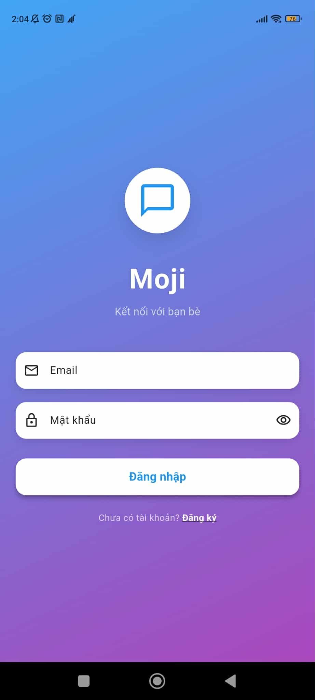
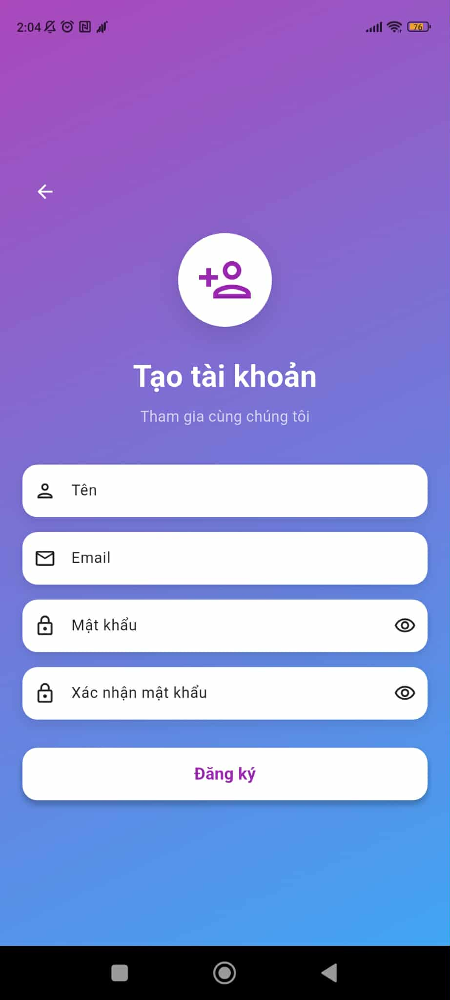
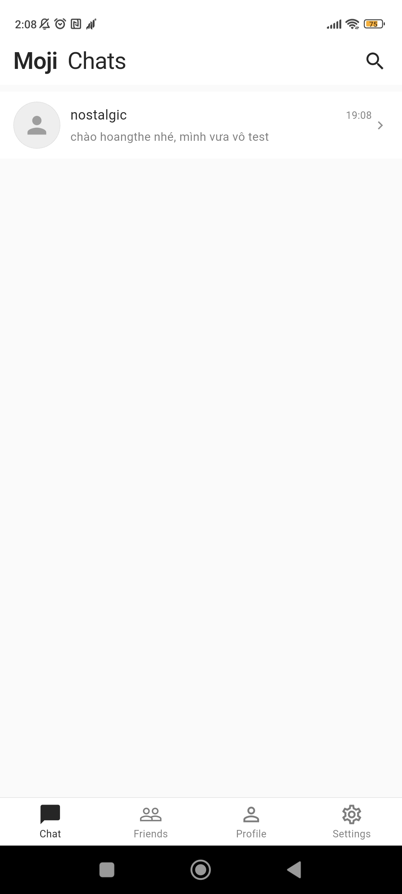
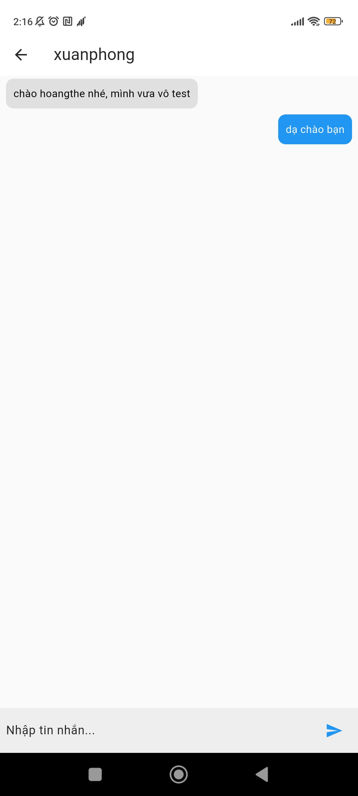
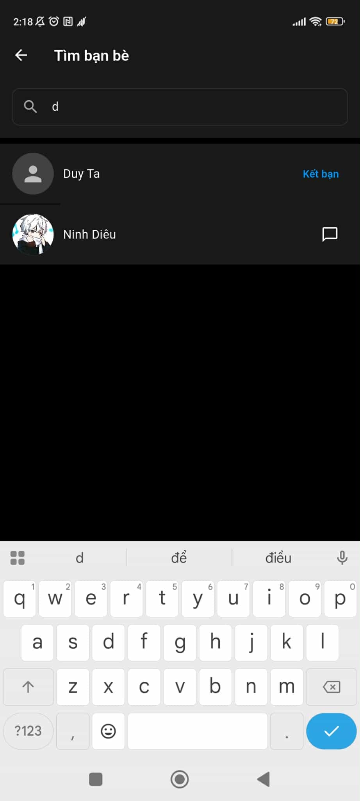
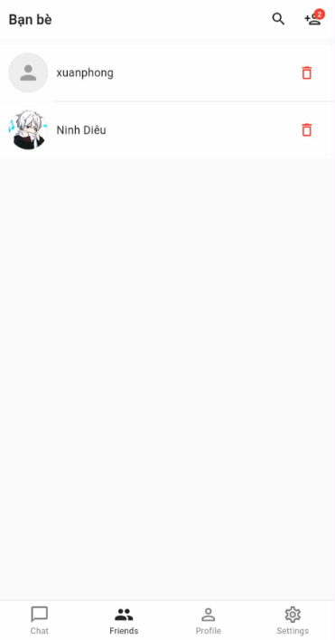
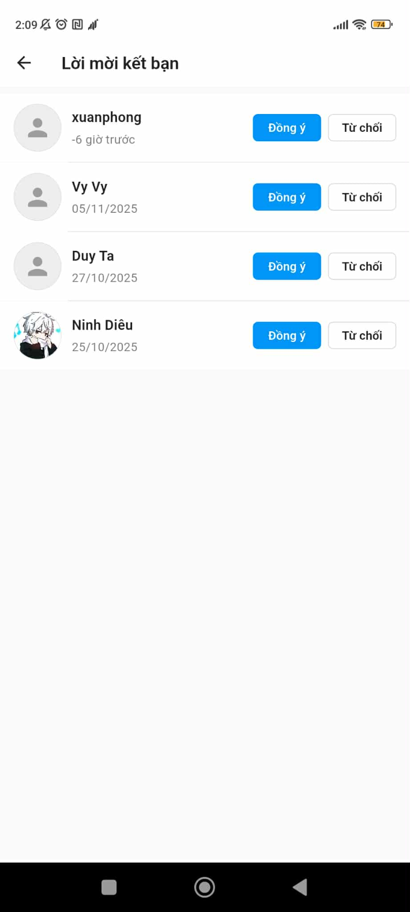
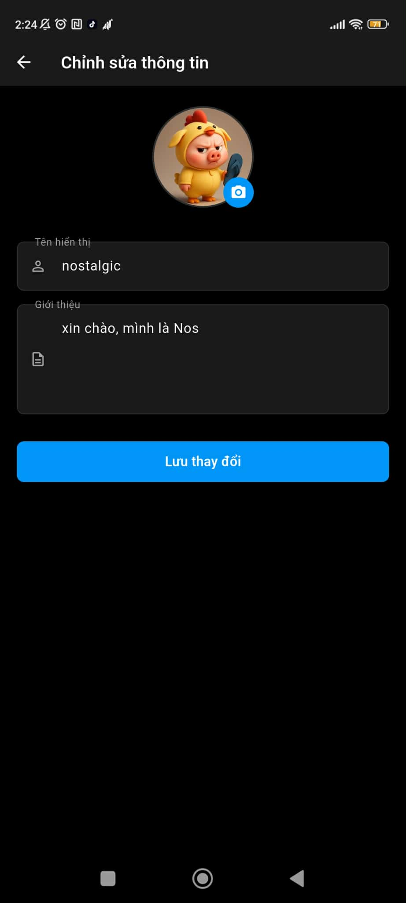
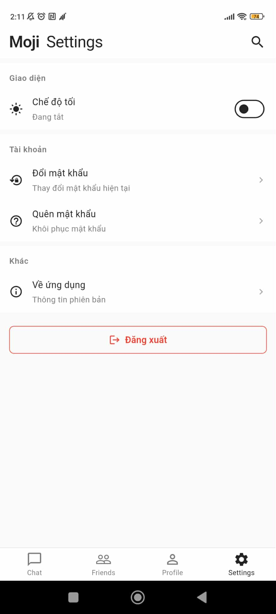
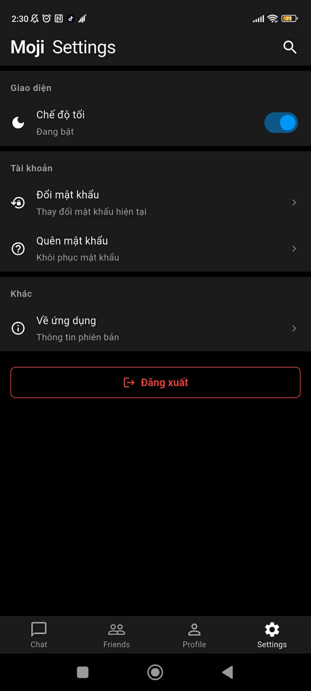

# 📱 Moji - Chat Application

<div align="center">


**Ứng dụng chat mượt mà được xây dựng với Flutter và Supabase**

[Features](#-features) • [Screenshots](#-screenshots) • [Tech Stack](#-tech-stack) • [Setup](#-setup) • [Project Structure](#-project-structure)

</div>

---

## 📋 Table of Contents

- [About](#-about)
- [Features](#-features)
- [Screenshots](#-screenshots)
- [Tech Stack](#-tech-stack)
- [Setup](#-setup)
- [Project Structure](#-project-structure)
- [Database Schema](#-database-schema)
- [Contributing](#-contributing)

---

## 🎯 About

**Moji** là ứng dụng chat mượt mà, cho phép người dùng kết nối, trò chuyện và xây dựng tình bạn qua giao diện đẹp mắt và dễ sử dụng.

### Tính năng nổi bật
- ✨ **Giao diện hiện đại**: Thiết kế đẹp mắt với hỗ trợ chế độ tối
- 🔐 **Bảo mật**: Xác thực bằng email/mật khẩu qua Supabase
- 💬 **Chat real-time**: Tin nhắn tức thời với trạng thái đã đọc
- 👥 **Quản lý bạn bè**: Gửi, chấp nhận và quản lý lời mời kết bạn
- 📸 **Avatar**: Tải lên và cập nhật ảnh đại diện
- 🌓 **Chế độ tối/sáng**: Chuyển đổi theme linh hoạt
- 📱 **Đa nền tảng**: Hỗ trợ Android và iOS

---

## ✨ Features

### Xác thực
- ✅ Đăng ký tài khoản bằng email và mật khẩu
- ✅ Đăng nhập/đăng xuất an toàn
- ✅ Quản lý phiên đăng nhập
- ✅ Tự động đăng nhập khi mở lại app

### Tính năng Chat
- ✅ Tin nhắn real-time
- ✅ Xem trước tin nhắn cuối
- ✅ Hiển thị trạng thái đã đọc/chưa đọc
- ✅ Thời gian tin nhắn (định dạng tương đối)
- ✅ Xóa cuộc trò chuyện (ấn giữ)
- ✅ Xóa tin nhắn của mình (ấn giữ)
- ✅ Trạng thái online/offline

### Tính năng Xã hội
- ✅ Tìm kiếm người dùng
- ✅ Gửi lời mời kết bạn
- ✅ Chấp nhận/từ chối lời mời kết bạn
- ✅ Xem danh sách bạn bè
- ✅ Xóa bạn bè
- ✅ Xem hồ sơ người dùng

### Quản lý Hồ sơ
- ✅ Xem hồ sơ của mình
- ✅ Chỉnh sửa hồ sơ (tên, giới thiệu)
- ✅ Tải lên và cập nhật ảnh đại diện
- ✅ Tự động làm mới sau khi chỉnh sửa

### Cài đặt
- ✅ Chuyển đổi chế độ tối/sáng
- ✅ Lưu cài đặt theme
- ✅ Đăng xuất

---

## 📸 Screenshots

### Authentication Screens

#### Login Screen

*Giao diện đăng nhập đẹp mắt*

#### Register Screen

*Đăng ký tài khoản với xác thực form*

---

### Main Screens

#### Home - Chat List

*Danh sách cuộc trò chuyện với tin nhắn cuối và trạng thái online*

#### Chat Detail

*Giao diện chat real-time với tin nhắn*

#### Search Users

*Tìm kiếm và kết nối với người dùng mới*

#### Friends List

*Quản lý danh sách bạn bè*

#### Friend Requests

*Chấp nhận hoặc từ chối lời mời kết bạn*

#### Edit Profile

*Cập nhật thông tin và ảnh đại diện*

#### Settings

| Chế độ sáng | Chế độ tối |
|------------|-----------|
|  |  |
| *Cài đặt - Chế độ sáng* | *Cài đặt - Chế độ tối* |

---

## 🛠 Tech Stack

### Frontend
- **Flutter** 3.9.2 - Cross-platform UI framework
- **Dart** 3.9.2 - Programming language

### State Management
- **flutter_bloc** ^9.1.1 - BLoC pattern for state management
- **equatable** ^2.0.7 - Value equality for states

### Backend & Database
- **Supabase** - Backend as a Service
  - Authentication
  - PostgreSQL Database
  - Real-time subscriptions
  - Storage (for avatars)

### Key Packages
```yaml
dependencies:
  flutter_bloc: ^9.1.1          # State management
  supabase_flutter: ^2.10.3      # Backend services
  cached_network_image: ^3.4.1   # Image caching
  intl: ^0.19.0                  # Date/time formatting
  image_picker: ^1.1.2           # Image selection
  shared_preferences: ^2.5.3     # Local storage
  provider: ^6.1.2               # Dependency injection
```

---

## 🚀 Setup

### Prerequisites
- Flutter SDK (3.9.2 or higher)
- Dart SDK (3.9.2 or higher)
- Supabase account
- Android Studio / Xcode (for mobile development)

### Installation

1. **Clone the repository**
   ```bash
   git clone <repository-url>
   cd authentication_with_supabase
   ```

2. **Install dependencies**
   ```bash
   flutter pub get
   ```

3. **Configure Supabase**
   - Create a new project on [Supabase](https://supabase.com)
   - Copy your project URL and anon key
   - Update `lib/main.dart` with your Supabase credentials:
     ```dart
     await Supabase.initialize(
       url: 'YOUR_SUPABASE_URL',
       anonKey: 'YOUR_SUPABASE_ANON_KEY',
     );
     ```

4. **Setup Database**
   - Run SQL scripts in Supabase SQL Editor:
     - Create tables: `users`, `conversations`, `messages`, `friends`, `friend_requests`
     - Setup RLS policies (see `SUPABASE_SETUP.md`)

5. **Setup Storage**
   - Create `avatars` bucket in Supabase Storage
   - Run `setup_storage_policies.sql` for RLS policies

6. **Run the app**
   ```bash
   flutter run
   ```

### Database Setup

See `SUPABASE_SETUP.md` for detailed database schema and RLS policies.

---

## 📁 Project Structure

```
lib/
├── auth/                    # Authentication logic
│   ├── auth_gate.dart      # Auth state management
│   └── auth_service.dart   # Auth operations
├── models/                  # Data models & services
│   ├── chat_service.dart   # Chat operations
│   ├── friend_service.dart # Friend management
│   ├── message_model.dart  # Message data model
│   └── user_model.dart     # User data model
├── routes.dart              # Navigation routes
├── screen/                  # UI Screens
│   ├── chat_detail/        # Chat detail screen
│   ├── chat_list/          # Chat list screen
│   ├── friends/            # Friend management screens
│   ├── home/               # Home screen with bottom nav
│   ├── login/              # Login screen
│   ├── profile/            # Profile screens
│   ├── register/           # Registration screen
│   ├── search/             # User search screen
│   ├── settings/           # Settings screen
│   └── user_profile/       # Other user's profile
├── services/                # Business logic services
│   ├── ProfileService.dart
│   ├── ThemeService.dart
│   └── conversation_service.dart
└── widgets/                 # Reusable widgets
    └── user_avatar.dart    # Avatar with online indicator
```

---

## 🗄 Database Schema

### Tables

- **users**: User profiles and authentication
- **conversations**: Chat conversations between users
- **messages**: Individual chat messages
- **friends**: Friend relationships
- **friend_requests**: Pending friend requests

### Key Features
- Row Level Security (RLS) enabled
- Real-time subscriptions
- Foreign key relationships
- Timestamps for all records

---

## 🎨 Design Philosophy

- **Giao diện đẹp mắt**: Thiết kế sạch sẽ, tối giản
- **Dễ sử dụng**: Điều hướng và tương tác trực quan
- **Mượt mà**: Hoạt động mượt mà trên các kích thước màn hình khác nhau
- **Linh hoạt**: Hỗ trợ chế độ tối/sáng cho trải nghiệm tốt hơn

---

## 📝 Notes

- All screenshots should be placed in the `screenshots/` directory
- Update screenshot paths in this README after adding images
- Recommended screenshot size: 1080x1920 (9:16 aspect ratio)

---

## 🤝 Contributing

Contributions are welcome! Please feel free to submit a Pull Request.

---

## 📄 License

This project is licensed under the MIT License.

---

## 👤 Author

**hoangthedevhoangthedev**
- GitHub: [@hoangvanthe-2806](https://github.com/hoangvanthe-2806)
- Email: hoangthe2862003@gmail.com

---

<div align="center">

**Made with ❤️ using Flutter & Supabase**

⭐ Star this repo if you find it helpful!

</div>
